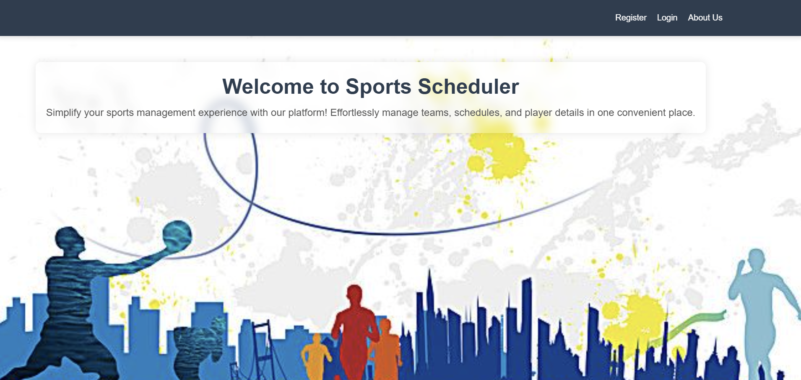
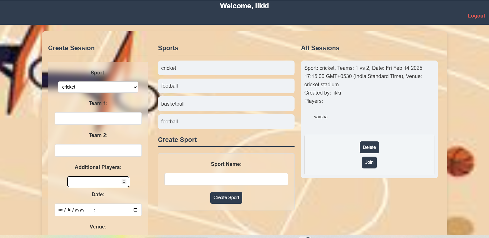
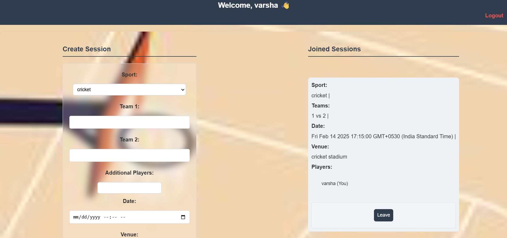
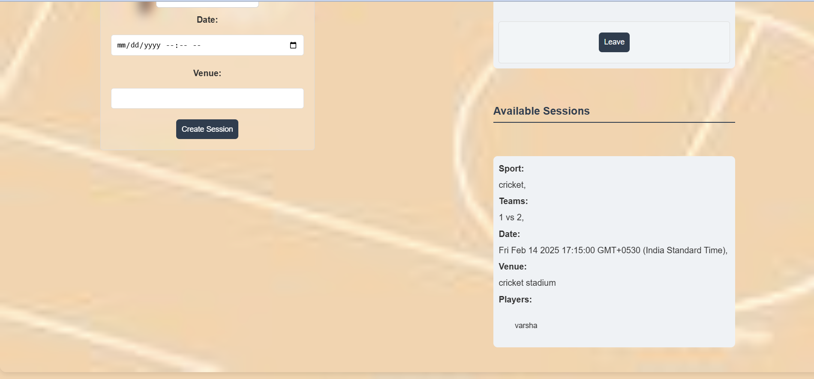
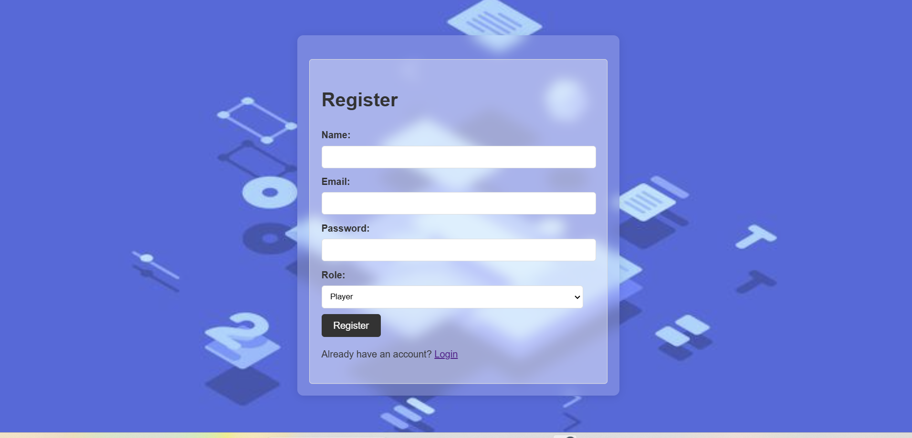

# **Sports Scheduler: Your Go-To Sports Event Planner 🏆**  

## **Introduction**  
Sports Scheduler is a dynamic web application built to **simplify the organization and management of sports events**. Designed as part of the **WD501 course**, this platform offers a streamlined experience for both **administrators and players**, enabling smooth scheduling and participation in sports activities.  

## **About the Project**  
The Sports Scheduler is a **user-friendly solution** that allows individuals to **plan, manage, and join sporting events with ease**. You can explore the **GitHub repository** [here](https://github.com/Vemula-VaraLakshmi/Sports_Scheduler).  

---

## **Project Highlights**  

### **The Challenge 🌟**  
As a capstone project for the **WD501 course**, the objective was to develop a **fully operational Sports Scheduler** that facilitates **active participation in sports** and encourages better event organization.  
#### ** HOME ** 

### **User Roles & Capabilities 🚀**  

#### **1️⃣ Administrator 🧑‍💼**  
- Oversees the catalog of available sports.  
- Adds, updates, and removes sports categories.  
- Gains insights from reports on completed games.  
- Accesses a dedicated **Admin Dashboard** for management.  

##### **Admin Dashboard Preview**  
   

#### **2️⃣ Player 🏅**  
- Creates an account and logs in with email authentication.  
- Schedules and organizes sports sessions.  
- Joins existing sessions.  
- Manages both hosted and joined sessions via the **Player Dashboard**.  

##### **Player Dashboard Preview**  

  

---

## **Key Functionalities 🎬**  

✅ **Admins efficiently handle sports management:**  
- Sign in, review existing sports, and introduce new sports effortlessly.  

✅ **Players benefit from an intuitive onboarding process:**  
- Quick sign-up and login with simplified forms.  
- Access interactive **Login and Register pages**.  

##### **Authentication Screenshots**  
  
  

✅ **Players can initiate and customize sports sessions:**  
- Set up sports events tailored to their preferences.  

✅ **Players can browse and join ongoing sports events:**  
- Easily discover and participate in available sessions.  

✅ **Admins can create and manage sports sessions:**  
- Enjoy a **seamless experience** in session scheduling.  

---

## **Setup Instructions 🚀**  

Follow these steps to **get started with the project locally**:  

### **1️⃣ Clone the Repository**  
Run the command below to download the project:  
```sh
git clone https://github.com/Likhitha-Setty/sports-scheduler.git
